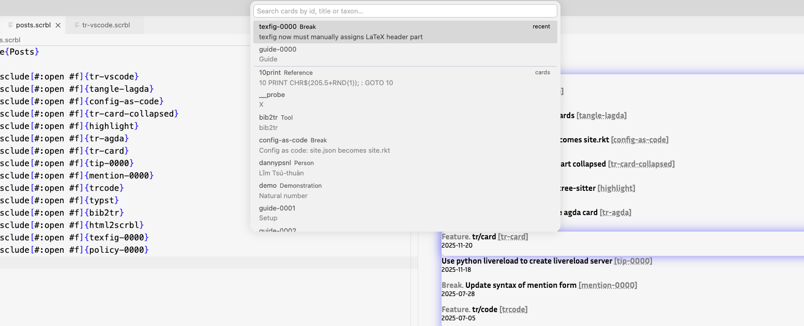
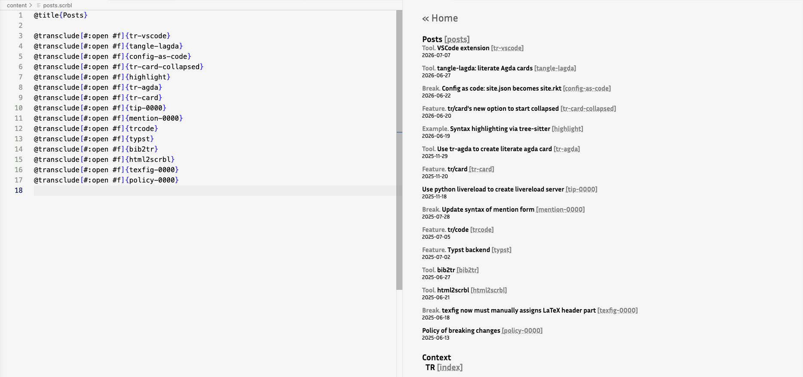

# tr-notes VSCode extension

Authoring support for [tr-notes](https://tr-notes.srht.site) projects (folders
with a `content/` directory of `.scrbl` cards).

## Features

### 1. Mention card search

Type `{` right after `@mention` or `@mention/hidden` (also `@mention["`) and a
vscode QuickPick card search pops up — the same interaction as vscode-violet's
symbol picker. Filter by any part of a card's **id**, **title** or **taxon**
(the fields the website's `fullTextSearch.js` indexes), recently-used cards
float to the top, and the chosen address is dropped into the slot.

You can also run **`tr: Insert Mention (card search)`** (`Cmd/Ctrl+Shift+M`)
to open the same picker from anywhere; it inserts a full `@mention{addr}` at the
cursor (or just the address when you're already inside a mention slot).

Card data comes from `_build/search.json` when present (produced by
`raco tr build`); otherwise it falls back to scanning `content/**/*.scrbl`.

### 2. New card

**`tr: New Card`** asks for an address prefix (Enter for none), runs
`raco tr next --random "<prefix>"` to allocate a fresh address, creates
`content/<addr>.scrbl` seeded with `@title{}`, and opens it with the cursor
inside the title.

### 3. Live preview

**`tr: Open Preview`** (`Cmd/Ctrl+Shift+V`, also a title-bar button on `.scrbl`
files) opens a side panel showing the built card. Switching between card
editors re-points the preview at the newly active card. Saving a `.scrbl` file
runs `raco tr build` (configurable) and refreshes the preview.

The preview loads `_build/<addr>/index.html` and rewrites its absolute asset
paths (`/style.css`, KaTeX, rendered SVGs, …) to webview URIs. Math is
server-side rendered, so cards display without any client-side scripting.

### 4. Open card

**`tr: Open Card (card search)`** (`Cmd/Ctrl+K` while editing a card) opens the
same card search as mention, but instead of inserting text it opens the chosen
card's `.scrbl` file in the editor — a quick way to jump between cards by id,
title or taxon. It shares the recently-used list with mention search, so a card
you just linked is easy to open.

> `Cmd/Ctrl+K` is a chord prefix in VSCode's defaults; this binding overrides it
> only while a `.scrbl` editor is focused. Run the command from the Command
> Palette to invoke it from anywhere.

## Settings

| Setting          | Default | Description                                        |
| ---------------- | ------- | -------------------------------------------------- |
| `tr.racoPath`    | `raco`  | Path to the `raco` executable.                     |
| `tr.buildOnSave` | `true`  | Run `raco tr build` when a `.scrbl` file is saved. |

## Running it

- **Dev:** open this folder in VSCode and press `F5` (Extension Development Host).
- **Install:** `npx @vscode/vsce package` then
  `code --install-extension tr-notes-0.1.0.vsix`.

`raco` must be on your `PATH` (or set `tr.racoPath`).
